# Appendix B: Guide to Operational Energy Modelling in ECCHO

## Introduction to Operational Energy Modelling in ECCHO

Homestar’s energy analysis tool, ECCHO (Energy and Carbon Calculator for Homes), is a Web App that allows users to calculate the heating and cooling demand, energy consumption, overheating risk, and carbon emissions of a home.

Once logged in, the various parts of the app can be accessed through the menu in the left-hand navigation bar. Each page allows users to create, edit, delete and review different aspects of a home's design including the _assemblies_ used (wall, roof, and floor build-ups), the _areas_ of walls, roofs and floors, the type and areas of _windows_ and the _ventilation_, lighting, and space and hot water heating _systems_.

<figure>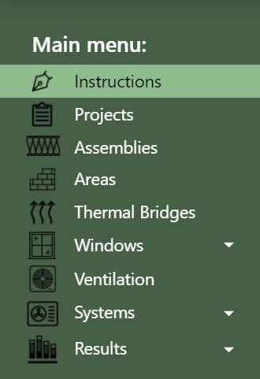<figcaption></figcaption></figure>

As the tool is completed, the headline heating and electricity demand figures are updated on the top navigation bar. These are the primary metrics for Homestar compliance. The next page shows each of the parts of the main parts of ECCHO.

Once complete, a dwelling's energy, carbon, and overheating results can be found by navigating to the results page. This page also shows the final points achieved for credits HC1, HC2, EF,4 and EN1, and the maximum Homestar rating as follows:

<figure>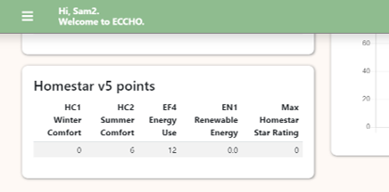<figcaption></figcaption></figure>

As can be seen, ECCHO provides a pathway for showing compliance with credits HC1, HC2, EF4, and EN1 in Homestar using the calculation pathway. Respectively these cover winter heating demand, risk of overheating in summer, overall energy use and carbon emissions and on-site renewable energy generation.

Use of ECCHO for these credits is not compulsory. Each credit allows alternative pathways such as thermal modelling or use of the full PHPP package (e.g. as part of Passive House compliance). Where these alternative pathways are used, the results must be entered into the Excel version of ECCHO. Details on how to do to this can be found in Appendix A which covers the Homestar energy modelling guide.

<figure>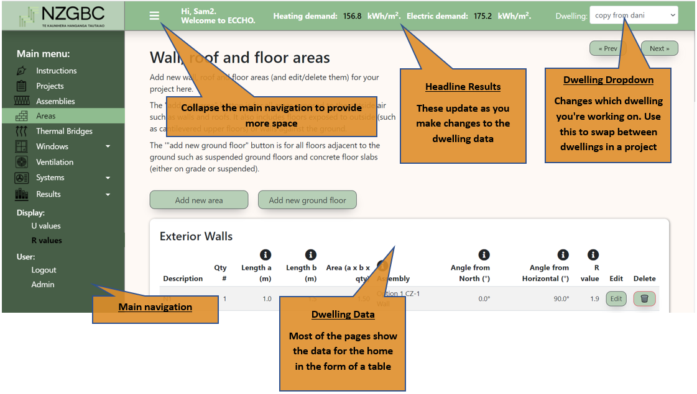<figcaption></figcaption></figure>

## Use of ECCHO for Homestar

For the purpose of submitting for a Homestar certification, users of ECCHO must either be a qualified Homestar Designer or Passive House Designer. Those undertaking a Homestar designer course will be issued with a 1 year ECCHO license as part of the course. Passive House designers wanting to use ECCHO should email [homestar@nzgbc.org.nz](mailto:homestar@nzgbc.org.nz) requesting a license. Licensing fees can be found on the NZGBC website.

Once you've been informed your email has been lodged with ECCHO you can navigate to the registration page where you'll be asked to enter a username and password.

## Compliance by Energy Modelling or Passive House certification

Note that ECCHO Online may not be used if demonstrating compliance following the energy modelling or Passive House pathways. For this, the excel version of ECCHO must be used. This has fields to enter results data from energy models.

In this case, only the Summary, Systems, lights and appliances and Refrigerants worksheets need to be filled in. The Summary worksheet allows for the input (cell L30) of space heating demand calculated using either dynamic simulation or PHPP. Those using dynamic simulation must carry out this energy modelling following the requirements of the Energy Modelling Protocol in Appendix A.

## Overview of ECCHO pages

Most of the pages in ECCHO need to be filled in to get the correct result for a Homestar submission following the calculation methodology. The following gives an overview of what each of the 5 compulsory pages does. 

<table><thead><tr><th width="170.3636474609375">Page</th><th>Description</th></tr></thead><tbody><tr><td>Projects</td><td>Register a new project and dwellings within that project. Set basic project and dwellings details such as address, floor area and climate zone.</td></tr><tr><td>Assemblies</td><td>This is where the R-values for each of the different wall, roof and floor constructions are entered and/or calculated.</td></tr><tr><td>Areas</td><td>This is where the areas of walls, ceilings and floors are entered, together with what they are made of (taken from the “R-values” worksheet) and their orientation.</td></tr><tr><td>Thermal Bridges</td><td>At least one thermal bridge for the slab edge must be defined on this page if the home has as a ground floor.</td></tr><tr><td>Windows</td><td>This is where windows and skylights (and doors) are defined and positioned (i.e. which wall or roof they are in).</td></tr><tr><td>Systems</td><td>Use these pages to input the space heating and hot water systems, shower flow rate(s), hot water storage (or not) and lighting and appliance efficiencies.</td></tr></tbody></table>

## Important Basics

ECCHO requires data to be entered in ways that are different to how users might have input them before in other thermal modelling tools. The following sets out some important things to note before you get started.

### Homestar rates an individual home

For the purposes of Homestar, ECCHO should be used to model an individual dwelling such as a standalone home or individual apartment or unit. If a dwelling is part of a building (such as an individual apartment within a larger apartment building) the tool must NOT be used to assess the overall building. For more details of how to assess homes that have similar layouts (typologies) please refer to Typology section.

### Ground floor R-value

Ground floors are dealt with differently to other thermal analysis programmes. The construction R-values of any ground floors are input in the same way as walls and roofs (i.e. ignoring the benefit of the ground). This means that the R-value for the ground floor is entered as the sum of the individual R-values of the components making up the ground floor such as the concrete slab and any underslab insulation. Calculated in this way, the R-value of a standard 100mm uninsulated slab is R0.18 (rather than R1.3 as assumed in the New Zealand Building Code).

This might seem very low, however ECCHO automatically calculates the benefit of the ground for you based on the ground floor dimensions and the climate zone (colder climates have colder ground).&#x20;


R-values for ground floors should not be calculated using NZS4214, nor taken from catalogues of standard R-values such as those found in the BRANZ House Insulation Guide.


### Ground floor edge heat loss

The heat loss from the edge of a ground floor (either concrete slab or suspended floor) is calculated separately on the thermal bridges pages. This is where the benefit of slab edge insulation can be entered.

### Use external measurements

NZS4218 (and tools based on this such as BRANZ ALF) asks for the internal measurements of walls, floors and roofs. ECCHO requires _**external**_ measurements to be used: this means, for example, that the height of a wall is measured from the bottom of the ground floor insulation (or concrete slab if there is no insulation) to the top of the roof insulation. The area of a concrete slab or roof is measured using the external plan dimensions of the home.

Note that the one _exception_ to this rule is the Conditioned Floor Area. This is the measure of _internal_ area within the thermal envelope.

### Windows

The overall R-value of a window is calculated from the dimensions of the window and the separate R-values of the glazing and window frame. This means that, if the window system you are using is not in ECCHO (many are defined), you will have to get this information from your window supplier. In addition, each pane in a window is entered separately.

## Projects

Use this page to start a new project and then define dwellings within that project. A project can be a multi-unit development or a single home. Each dwelling within the project could be a different home or variations of the same home you wish to test.

### Creating a New Project

Begin by clicking on 'Start new project'. This will bring up a form asking for details of the project. Only the project name and climate file are compulsory.

### Climate File

ECCHO has 19 sets of climate data (generally) based on the climate of the biggest city in that area. The climate data is automatically selected based on the Local Authority that the project is based in. ECCHO automatically adjusts this climate data based the height (altitude) of the project relative to the height of the climate zone data above sea level (see next).

<figure><figcaption></figcaption></figure>

### Assigning a New Dwelling to a Project

Next, click on 'Add new dwelling'.

The following information must be provided:

#### **Conditioned Floor Area (CFA)**

This is the _internal_ area of the building (measured along the line of the final finish, e.g. internal linings) that falls _within the thermal envelope_. It therefore excludes any unconditioned areas such as garages. See 'Area Definitions' for more details in the opening chapter of the Technical Manual.

#### **Altitude**

This is the height of the building (in metres) above sea level. This can be found easily on Google Earth (bottom right-hand corner when you hover over the building site).

#### **Winter and Summer interior temperature**

The winter temperature defaults to 20℃. This is the temperature the home is assumed to be heated to 24/7 throughout the year.

The summer temperature defaults to 25℃. For Homestar compliance ECCHO calculates the percentage of the year the home is predicted to exceed this temperature. ECCHO also calculates the amount of cooling energy needed to maintain this temperature.

As we will see later when we cover the Results pages, ECCHO is able to provide either 'Homestar' results or 'Custom' results. The Homestar results fix the heating and cooling set point at 20℃ and 25℃ respectively. The custom results allow users to examine the effect of different assumed setpoints.

#### **Thermal mass type**

This is a simplified definition of the dwelling's thermal mass based on the number of storeys and construction type. If you wish to enter a custom thermal mass, click 'user defined' and then enter the total thermal mass of the dwelling in Wh/K /m2.

#### **Orientation**

The orientation of each wall and roof will be entered later in the Area page. At a higher level, on the Project page, ECCHO offers the opportunity to vary the overall orientation of the dwelling allowing users to test different orientations.

The angle entered here (Ɵ), measured clockwise from solar North, adjusts the orientation of each wall and roof by that number of degrees.

<figure>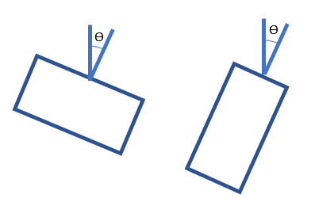<figcaption></figcaption></figure>

This facility also allows users to enter all walls and roofs at the cardinal angles (0° for North, 90° for East, 180° for South and 270° for West) and then alter the orientation of the whole dwelling from solar North.

### Copying Existing Dwellings

Dwellings can be copied within a project (to test variations) or copied from other projects. To copy dwellings _within_ a project, click on the 'copy' button associated with the dwelling you wish to copy. Give the copied dwelling a new name. All dwelling names within a project must be unique.

Each dwelling has a unique ID. This ID can be found by clicking on the copy dwelling button. It can be emailed to other ECCHO users to allow them to copy the dwelling into their project.

Please submit this unique ID for any ECCHO model submitted for Homestar certification. This is to allow the NZGBC admin team to confirm the dwelling has been entered on the system.

To use the unique ID to copy a dwelling into your project click on 'Copy dwelling from unique ID' at the top of the page.

<figure><figcaption></figcaption></figure>

### Assemblies       &#x20;

The Assemblies page is where the R-values for each of the different wall, roof and floor constructions are entered and/or calculated. ECCHO stores a discrete set of assemblies for each project. These are shared across all dwellings in the project. Assemblies may also be copied from other projects.&#x20;

<figure>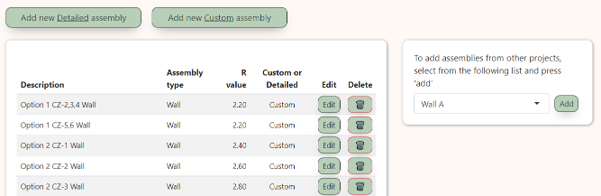<figcaption></figcaption></figure>

## Introduction

For each assembly type, it is possible to enter either custom R-values (e.g., taken from the BRANZ Home Insulation Guide or Design Navigator) or detailed R-values calculated using the thicknesses and thermal conductivity values of each of the layers of that construction.

### Custom R-value

For custom R-values, simply enter the construction name (description), R-value and assembly type (i.e. wall, roof or floor). Make sure you use a sensible name for your assembly so you can find it when you enter the building geometry in the Areas page.

### Detailed R-value

For detailed R-values, enter the assembly name (as with custom R-value), its type (either wall, floor or roof), and then enter each of the components that make up that assembly. For each layer you’ll need to enter the material name, its thermal conductivity (λ W/(mK)) and its thickness in millimetres. ECCHO includes default materials and thermal conductivity values from NZS4214, but also allows user-defined materials. The default values can be searched by typing keywords into the respective input boxes, e.g. typing 'insulation' will bring up all of the default insulation materials in the tool.

As you enter values the calculated R-value is updated on the top right-hand corner of the form.

Please note: R values are calculated in ECCHO according to the international standard, ISO 6946. The current version of the NZ Building Code references NZS4214, which follows a different (more conservative) calculation method, and therefore R-values calculated on this sheet may not be submitted for Building Consent under the Schedule method. ECCHO may be used, however, to submit for Building Consent following the modelling method.

<figure>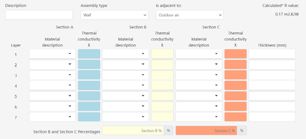<figcaption></figcaption></figure>

The tool allows for up to 3 pathways (sections A, B and C) for heat to flow through the build-up. In a timber wall, for example, heat can flow through the insulation, but also through the studs that are bridging that insulation. Enter the proportion (as a percentage) of the assembly taken up by each section.

Unless evidence is provided to the contrary, any timber framed walls should be assumed to have a 30% timber fraction. This is in line with a study for BRANZ carried out by Beacon Pathway.

If a layer only has one material, this only needs to be entered once in section A, and will automatically be carried through to sections B and C.

In the section titled “Adjacent to” enter whether the construction is next to the outdoor air, is ventilated or is adjacent to the ground.

This is what this means:

<table data-header-hidden><thead><tr><th width="150.3636474609375" valign="top"></th><th valign="top"></th></tr></thead><tbody><tr><td valign="top">Outdoor air</td><td valign="top">Use this for any constructions where heat flows direct to outside, but that do not have a ventilated cavity (see below).</td></tr><tr><td valign="top">Ventilated</td><td valign="top">Use this for typical build ups that have an external ventilated cavity. This would include the standard New Zealand wall comprising timber frame and weatherboard cladding over a ventilated cavity, a ventilated roof or suspended timber ground floor. Note that the thermal resistance of any constructions exterior to the ventilated cavity should be ignored.</td></tr><tr><td valign="top">Ground</td><td valign="top">Use this for build-ups that are directly on the ground.</td></tr></tbody></table>

### Important Note About Floor R-values

When entering floor R-values – especially custom ones – the value to be entered is simply the R-value of the construction _ignoring the benefit of the ground_: This ground benefit is calculated within ECCHO. As an example, the R-value of a 100mm concrete slab with 25mm of full cover EPS is calculated to be R0.88 in ECCHO. The R-value of an uninsulated 100mm concrete slab is R0.18.

Under no circumstances can slab or suspended floor R-values be sourced from the BRANZ Home Insulation Guide or Design Navigator.

### Slab-edge Insulation

The benefit of slab-edge insulation is calculated separately. See next section on thermal bridging for details.

### Areas Adjacent to Unconditioned Spaces

Areas of wall that lose their heat to unconditioned spaces such as garages and unheated corridors, may have their R-values increased to account for the reduction in heat lost through the unconditioned space.

For custom R-values this can be achieved simply by adding an appropriate thermal resistance (Ru) to the overall value sourced from, say, the BRANZ Housing Insulation Guide.

For detailed R-values ECCHO has a dedicated field for entering the additional R-value. Give this a description that makes it obvious to the Homestar assessor what the layer relates to.

#### Unheated garages

Figure 4: Thermal resistances of unheated garages below has a range of thermal resistances for different configurations of unheated adjacent garage. The table is sourced from the UK Standard Assessment Procedure (SAP) that governs energy calculations for the UK Building Code.

#### &#x20;Communal Corridors and Stairwells

&#x20;Any walls between a dwelling and a communal corridor heated to a minimum of 16°C can be excluded (i.e. deemed adiabatic). Stairwells are to be deemed unconditioned, unless it can be proven that they are open to the corridors (e.g. no door separation, or fire door held permanently open on magnets which would only shut if a fire alarm is triggered).

For clarification, lift shafts shall always be deemed unconditioned.

Walls adjacent to an unheated/unconditioned corridor should have an additional thermal resistance added as per the figure below.

<figure>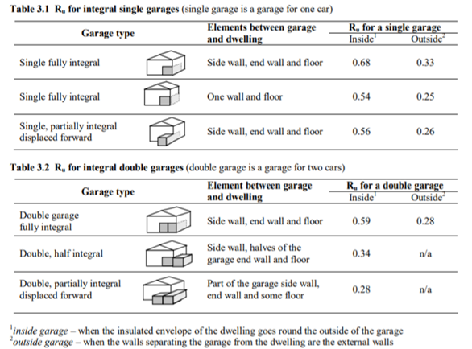<figcaption></figcaption></figure>

<figure>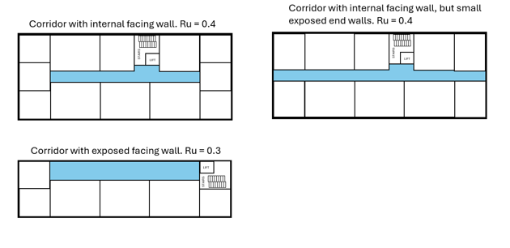<figcaption></figcaption></figure>

## Areas

The Areas page is where the areas of walls, ceilings and floors are entered, together with what they are made of (taken from the Assemblies page) and their orientation.

#### Introduction

For each area of roof and wall it is necessary to enter information on the name, area type, area (expressed as length a x length b), assembly type, orientation, and angle from horizontal as follows:

<figure>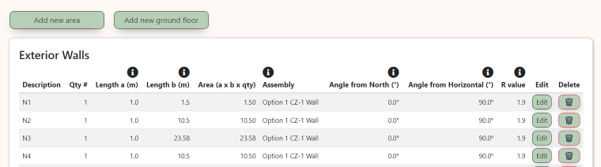<figcaption></figcaption></figure>

#### **Description**

Enter an appropriate name for the area of roof or wall. This will be used on the Windows page when you allocate windows to particular walls and roofs.

#### **Group**

Set the type of area here. This can be exterior wall, exterior roof, wall adjacent to ground or floor to outside.

Floors to outside are for floors that are open to the air such as cantilevered upper floors. Note that this does not include suspended ground floors. These should be entered by clicking 'Add new ground floor'.

<figure>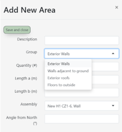<figcaption></figcaption></figure>

#### **Length a(m), b(m) and Area**

Enter the dimensions of the wall, roof or floor _using external dimensions. Either enter the dimensions as (length a) x (length b) or, if the element area is known, enter '1' for (length a) and then (length b) becomes the area in m__2__. There is also a quantity field: the calculated area is therefore:_

$$
\text{length}_a \times \text{length}_b \times \text{quantity}
$$

#### **Assembly**

This is the type of wall, roof or floor that you defined in the Assemblies page. This pulls through the calculated R-value for that element.

#### **Angle CW (clockwise) from Primary Elevation**

This is the direction the element of wall, roof, or floor faces relative to the primary elevation set on the Projects page. The angle entered here (Ɵ) is measured clockwise from the primary elevation. For example, a perfectly East facing wall would be entered as 90° assuming that the primary elevation faces North.  For roofs this has little impact on the results unless that part of the roof has rooflights.

#### **Angle from Horizontal**

This is entered by default when you create a new area as 0° for flat roofs, 180° for floors and 90° for upright walls. Once created, the angle from horizontal can be edited for roofs and walls. Floors may not be edited and will always have a value of 180°.

#### **Ground Floors**

Areas of concrete floor slabs or suspended timber (or concrete) floors are entered separately by clicking on 'Add new ground floor'. A floor is considered to be adjacent to the ground if it is less than 500mm above the ground.

When entering these ground areas you will be asked whether the area is a suspended floor or slab on grade. You will also be asked for the perimeter length. This is the length of the perimeter that loses heat to outside and therefore excludes perimeter shared with an adjacent dwelling. It does however include lengths of perimeter adjacent to unheated spaces such as garages.

## Thermal Bridges

The Thermal Bridges page is where you enter details on the heat lost through junctions such as the junction of the wall with roofs and floors. These are expressed as psi values; the heat lost for each metre length of junction.

As a minimum, for a Homestar submission, the psi values for the slab (or suspended floor) edge must be included. If the psi value for the slab or suspended floor is not known, it should be input by default as 1.0 W/(m.K). The length of this is the length of the slab or suspended floor that loses heat to the outside: it excludes intertenancy walls but includes junctions with an unheated space such as a garage.

<figure>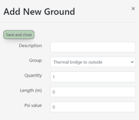<figcaption></figcaption></figure>

In addition, where junctions are exempt from the fRSI requirements of HC4 (deemed to satisfy junctions such as balcony edges in apartments) these must also be included with a default psi value of 1.0 W/(m.K) unless the psi value is known.

The psi value for any junction that is bridged with high thermal conductivity material (such as non-thermally broken concrete or steel) must be included in the model. Psi values for lengths of thermal bridge that are between the dwelling and a heated corridor may be excluded as per the section on calculating R-values.

Additional thermal bridges may be added, and this may be beneficial where details are known to be high performing. Psi values for high performing junctions can be negative meaning that they reduce the estimated annual energy demand.

Psi values for common New Zealand residential construction details can be found [here](https://passivehouse.nz/hpcd-handbook/). This includes concrete slabs with edge insulation.

For each thermal bridge enter a description, the boundary condition, the quantity, the length and the psi value. The 'group' dropdown with the following meanings:

<table data-header-hidden><thead><tr><th width="204.90911865234375"></th><th></th></tr></thead><tbody><tr><td><strong>Thermal bridges to outside</strong></td><td>These are thermal bridges direct to the outside air, such as the junction of a midfloor or eaves with the outside walls.</td></tr><tr><td><strong>Ground perimeter thermal bridge</strong></td><td>These are thermal bridges where the perimeter of the thermal envelope meets the ground. A slab edge is an example of a perimeter thermal bridge.</td></tr><tr><td><strong>Thermal bridges FS/BC</strong></td><td>Thermal bridges FS/BC. This stands for Floor Slab / Basement Ceiling. It refers to thermal bridges through the floor of the home to the ground such as where a slab has been thickened (at the expense of insulation) to support a load-bearing wall.</td></tr></tbody></table>

### Calculation of psi values

Psi (and fRSI) values can be modelled in various software packages including Therm and Flixo. Where junctions are between the home and an unheated internal space such as a garage or corridor, the additional R-value of the space may be included in the model – see Areas Adjacent to Unconditioned Spaces section above.

## Windows

The Windows pages are where the R-values, thermal performance, position and orientation of windows and skylights are defined.

<figure>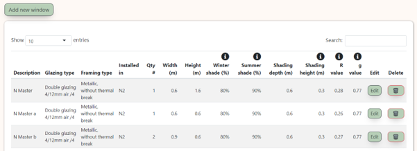<figcaption></figcaption></figure>

Each row in the table defines an individual pane of glass/glazing in your dwelling. Enter the quantity, a description, the width and height and which wall/roof the window(s) and/or skylight(s) are installed in. The wall or roof element is taken from the Areas page.

Note that a window with multiple panes and mullions can be entered in one row. As an example, the window in Figure 6 can be entered with the dimensions of one of the panes and 6 entered for the quantity.

<figure>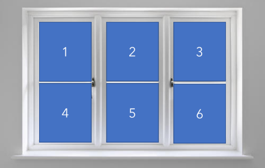<figcaption></figcaption></figure>

Next enter the glazing type and frame type from the dropdown. ECCHO has a wide selection of predetermined glazing units from a selection of suppliers, however custom glazing can be defined by navigating to the Glazing and Frames pages.

Note that ECCHO automatically calculates the overall R-value of the window or skylight (Rwindow) from the dimensions of the window, the centre pane R-value and the frame performance. It is not possible to enter a standard overall window R-value (Rwindow) from other sources (e.g supplier catalogues), so if the window system is not already in the dropdown menu, it is necessary to source data from your supplier on centre pane R-values and frame performance.

Finally, please define the level of window shading. This can be entered both as a percentage and/or by defining the dimensions of any horizontal shading devices.

### Winter and Summer Sun Admitted

The percentage shading (winter and summer sun admitted) is most useful for external obstructions such as self-shading (i.e. L shaped building), nearby buildings or vegetation (such as trees).

This percentage can be calculated for each façade/window using raytracing software. Alternatively, it is acceptable to use the values in the tables below. These must be applied on a façade-by-façade basis dependent on the actual level of complexity or overshading for each façade. The values from each table are multiplied together, so medium site shading with L-shaped form would result in 80% x 90% = 72% winter sun admitted.

#### Site Shading



* Houses in an open field without large hill or dense bush around.
* Upper storey apartments with the surrounding building being the same height or lower.
* All rooflights.

| Winter | Summer |
| ------ | ------ |
| 90%    | 100%   |



* Houses or multi-unit dwellings in a neighbourhood with similar types of housing next door.
* Middle storey apartments with other 3-storey apartments across the street.

| Winter | Summer |
| ------ | ------ |
| 80%    | 90%    |



* Single story house with 2 storey neighbouring buildings or established trees around.
* Ground floor apartment with other 3-storey apartments across the street.

| Winter | Summer |
| ------ | ------ |
| 70%    | 80%    |



* House or ground floor apartment surrounded by taller buildings where the distance between the rated dwelling and the surrounding building(s) is less than the height of the surrounding building.

| Winter | Summer |
| ------ | ------ |
| 60%    | 70%    |



#### Self Shading



* Houses or multi-unit dwellings that are a simple, rectangular shape without additional shading screen.
* Most apartment units.

| 100% |
| ---- |



* Houses or multi-unit dwellings that are not in rectangular form.

| 90% |
| --- |



* Houses with pavilions and links.
* Any building type with extensive use of shading screens.

| 80% |
| --- |



* Apartment units with recessed balcony (balcony wing wall on both sides).

| 70% |
| --- |




Ventilation
-----------


The ventilation page is where users define the mechanical ventilation systems used for both winter background ventilation and summer ventilation for avoidance of overheating. The page also defines the level of airtightness of the home.

<table><thead><tr><th width="181.727294921875" valign="top">Input</th><th valign="top">What this means</th><th valign="top">Notes</th></tr></thead><tbody><tr><td valign="top"><strong>Room height</strong></td><td valign="top">This is the average <em><strong>internal</strong></em> room height in metres.</td><td valign="top">ECCHO multiplies this value by the conditioned floor area to give the overall conditioned volume of the home in m3.</td></tr><tr><td valign="top"><strong>Infiltration</strong></td><td valign="top">
If the home is not going to be pressure tested leave this at the default 5 air changes per hour.

If the building has been pressure tested (or is going to be pressure tested) input the appropriate pressure test result (or expected result) from the drop down.
</td><td valign="top">
Homes that have not been pressure tested will be assumed to have an air tightness of 5 air changes at 50Pa. This is the average air tightness of new homes tested by <a href="https://www.buildmagazine.org.nz/index.php/articles/show/airtightness-trends">BRANZ</a>.

If it is intended to pressure test the home, it is acceptable to select a target air-permeability at design submission. However, this will need to be updated for the built submission on the basis of the actual pressure test result.
</td></tr><tr><td valign="top"><strong>Ventilation fans</strong></td><td valign="top">Select the make and model of ventilation fans for whole-house ventilation. This could be a continuous extract system or MVHR (Mechanical Ventilation with Heat Recovery) system. If the home just has an intermittent ventilation (i.e. kitchen rangehood and bathroom fan on a switch) please select "intermittent kitchen and bathroom extract".</td><td valign="top">Please contact the NZGBC if you have products or systems that you would like to be added to ECCHO.</td></tr><tr><td valign="top"><strong>Ventilation type</strong></td><td valign="top"><strong>Natural</strong></td><td valign="top">
Opening windows in habitable rooms and intermittent mechanical ventilation in wet rooms (kitchens, bathrooms, laundry).

Note that this form of ventilation is generally not permissible in Homestar v5.
</td></tr><tr><td valign="top"></td><td valign="top"><strong>Extract only</strong></td><td valign="top">Continuous extract ventilation</td></tr><tr><td valign="top"></td><td valign="top"><strong>Balanced</strong></td><td valign="top">Mechanical ventilation with heat recovery, often referred to as MVHR.</td></tr><tr><td valign="top"><strong>Summer mechanical ventilation/bypass rate (ac/h)</strong></td><td valign="top">Mechanical ventilation rate during the summer in air changes per hour.</td><td valign="top">
This input is for any continuous whole-house mechanical ventilation that is being provided without heat recovery. This would either come from a continuous extract system or MVHR system with summer bypass. Please enter the whole-house air change rate being achieved by the system in air changes per hour.

 
</td></tr></tbody></table>

#### Mechanical Ventilation with Heat Recovery

If you select a balanced system from the Ventilation Fans dropdown a further input form will appear asking for details of the location of the MVHR unit and the length and insulation properties of the ductwork.

#### Location

Location refers to the location of the supply and extract fans and/or MVHR unit. 'Inside' means that the MVHR system is within the thermal envelope. 'Outside' means that the MVHR system is outside the thermal envelope, e.g., within the loft space.

#### Insulation thickness

This is simply the thickness of the insulation in mm. For simplicity, ECCHO makes an informed assumption about the thermal conductivity of this insulation.

#### Duct Length

This is the length (m) of ductwork between the MVHR unit and the boundary of the thermal envelope. This means that it refers to different ductwork depending on whether the unit is located inside or outside the thermal envelope.

* **Inside**: this refers to the exhaust and fresh air intake ductwork. This is the blue ductwork in the diagram below.
* **Outside**: this refers to the extract and fresh air supply ductwork. This the red ductwork in the diagram below up to the point where it enters the thermal envelope (i.e. goes through the topmost ceiling.

<figure>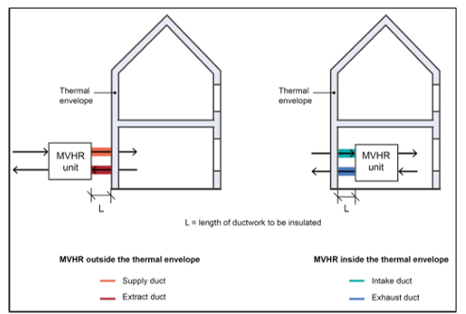<figcaption></figcaption></figure>

In both cases the measurement is the average length, i.e. total length of supply and extract ductwork divided by 2.

#### Summer Natural Ventilation

The summer ventilation rates are calculated by entering the openable window areas on one or multiple sides of the home.

Begin by estimating how often windows can be left open. The openable window areas refer to times during which windows can be left open safely and without fear of intruder entry.

There are 3 options available for window security as follows:

<table><thead><tr><th width="208.54541015625" valign="top">Window opening option</th><th valign="top">What this means</th></tr></thead><tbody><tr><td valign="top">Cannot be opened for reasons of noise, security or pollution</td><td valign="top">
Choose this option where in normal circumstances occupants are unlikely to use windows for reasons of noise, security, or pollution. This would typically be where homes are near a noisy road or airport. If this is ticked ECCHO assumes that no ventilation is provided via the window.

In these circumstances it is probable that summer ventilation is being provided mechanically - see below.
</td></tr><tr><td valign="top">Can be opened during occupied hours</td><td valign="top">Choose this option if most windows in the home can be opened while occupants are at home, but unlikely to be opened during unoccupied hours for reasons, say, of risk of intruders.</td></tr><tr><td valign="top">Can be opened at all times</td><td valign="top">Choose this option if most windows can be left open at all times. This would typically be where windows have security restrictors, or high level clerestory windows that allow them to be left open when occupants are not at home.</td></tr></tbody></table>

#### Window opening areas

Enter the total length and height of window openings on one side (single sided ventilation) and the other side (if double sided ventilation). Which of the walls are on "one side" or the "other side" of the home are at the discretion of the assessor, but the following diagram gives an example with one side and opposite side walls marked in red and blue.

<figure>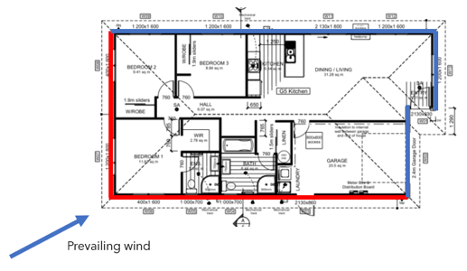<figcaption></figcaption></figure>


The window opening area is the opening free area. This is NOT the face area of the opening window (as New Zealand Building Code clause G4). This is the area of the opening perpendicular to the window being opened and needs to be calculated based on the extent to which the window can be securely opened (i.e. on 100mm restrictors for safety or security).


<figure>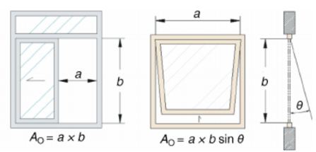<figcaption></figcaption></figure>

As an example, the free area of the sash window (left) would be a x b (assuming that this area can be left open securely or without excessive noise), however the free area of the casement window (right) is NOT a x b since the opening is limited to the area at the bottom of the window. The height of a casement window such as this on a 100mm restrictor can simply be entered as 0.1 (i.e. 100mm), so the opening area would be length ‘a’ x 0.1.

## Systems

The space heating, hot water, lighting, appliances and refrigerant systems can be accessed from the 'Systems' tab in the main navigation.

<figure>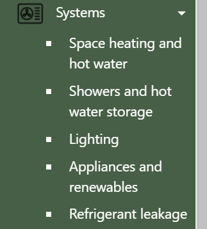<figcaption></figcaption></figure>

### Space and Hot Water Heating

Up to two (4) systems each can be entered here for space heating and hot water. For space heating, this will usually be the main space heating system used in the living areas and any supplementary heating used in the rest of the home. For hot water, a typical New Zealand home will have one hot water system (e.g. an electric cylinder or gas califont), but the tool offers the opportunity to enter a second system (e.g. a separate electric shower).

Homestar requires a fixed heating system to be present in at least the main living areas. If no fixed space heating systems are present elsewhere in the home (such as in bedrooms) the first space heating system defaults to electric portable heater, with a COP of 1.0.

<figure>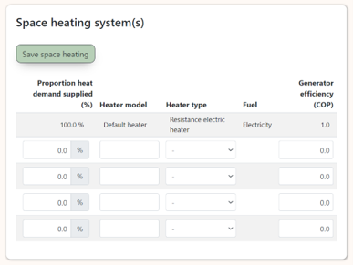<figcaption></figcaption></figure>

Please enter the fuel type for each of the systems and an efficiency (Coefficient of Performance, COP). The COP must be obtained from manufacturer/supplier data. For heat pumps the COP data must be based on climate data appropriate to the project site. In most New Zealand locations (except the far North and Alpine regions) the H1 performance data (based on an assumed outdoor temperature of 7°C) would be appropriate as a seasonal temperature. This Is the standard temperature at which heat pump performance data is supplied In New Zealand. However, we understand that EECA (and the NZ heat pump industry) is working on methodologies for supplying more accurate seasonal COPs and these will be preferred once they become available.

If the manufacturer/supplier cannot give you the correct COP data, please enter a default COP as follows. Note that these values can also be used at early stages of design when you may not have selected a particular make and model. However, they are very conservative and will hence make compliance more difficult.



<table data-search="false"><thead><tr><th width="355.09088134765625" valign="top">System type</th><th width="169.1876220703125" align="center" valign="top">Default COP</th></tr></thead><tbody><tr><td valign="top">Electric panel heater</td><td align="center" valign="top">1.0</td></tr><tr><td valign="top">High wall (split) heat pump</td><td align="center" valign="top">2.5</td></tr><tr><td valign="top">Ducted heat pump</td><td align="center" valign="top">2.5</td></tr><tr><td valign="top">Gas boiler</td><td align="center" valign="top">0.8</td></tr><tr><td valign="top">Gas fire</td><td align="center" valign="top">0.7</td></tr><tr><td valign="top">Wood stove</td><td align="center" valign="top">0.7</td></tr><tr><td valign="top">Wood pellet boiler</td><td align="center" valign="top">0.8</td></tr></tbody></table>



<table data-search="false"><thead><tr><th width="355.363525390625" valign="top">System type</th><th width="150.0966796875" align="center" valign="top">Default COP</th></tr></thead><tbody><tr><td valign="top">Electric (immersion) cylinder</td><td align="center" valign="top">1.0</td></tr><tr><td valign="top">Electric heat pump (Separate condenser)</td><td align="center" valign="top">2.0</td></tr><tr><td valign="top">Electric heat pump (integral condenser)</td><td align="center" valign="top">2.0</td></tr><tr><td valign="top">Gas califont</td><td align="center" valign="top">0.8</td></tr><tr><td valign="top">Gas boiler</td><td align="center" valign="top">0.8</td></tr></tbody></table>



#### Percentage heating met by system

Please enter the percentage of heat demand met by each space heating and hot water system.

Where zones of the home are heated by different systems, divide the conditioned floor area of the dwelling into approximate heating zones according to space heater type. In the case of non-centrally heated homes which have a large heater that heats more than the room/space it is in (typically a wood burner or large heat pump), only account for rooms/spaces which are:

* situated a storey higher than the heater itself, AND have a clear air pathway for the heat to get there (e.g. a stairwell), OR
* attached to the room/space through a heat transfer system, OR
* an adjoining hallway (i.e. the hallway space open to the room/space containing the heater can be counted).

The Assessor must verify the ability of this large heater to heat more than the room/space that it is in by reviewing the manufacturer’s data.

### Hot Water

#### Shower flow rates

Use this section to enter the measured flow rate or WELS rating of all showers used in the home. Up to 3 different shower types may be entered.

ECCHO assumes that each occupant takes 0.9 showers per day with a duration of 6 minutes. This is broadly based on the BRANZ WEEP study. The remaining hot water (in addition to shower hot water) is assumed to be 15.1 litres per day per occupant plus a fixed amount of 7.5 litres per dwelling.

#### Hot water storage and pipework insulation

Use this section to enter whether the home has any hot water storage such as an electric immersion cylinder (by far the most common hot water system in New Zealand). ECCHO assumes standard heat losses for A-grade cylinders:

This section requires input of the cylinder size, its location (indoors or outdoors) and the quality of the insulation of the first 2m of hot water distribution pipework from the cylinder. The following is a guide:

<table><thead><tr><th width="155.81817626953125" valign="top">Quality</th><th valign="top">Description</th></tr></thead><tbody><tr><td valign="top"><strong>Excellent</strong></td><td valign="top">All exposed pipework and fittings insulated continuously under the clamps with insulation thickness twice the diameter of the pipework. Insulation on fittings carefully glued and fitted.</td></tr><tr><td valign="top"><strong>Medium</strong></td><td valign="top">All exposed pipework and fittings insulated continuously under the clamps (or non-metallic clamps over-insulated) with 13mm insulation. Insulation on fittings carefully glued and fitted or fitted and taped with designed for this application</td></tr><tr><td valign="top"><strong>Normal</strong></td><td valign="top">All exposed pipework and fittings insulated reasonably with very few gaps with 13mm insulation</td></tr><tr><td valign="top"><strong>Uninsulated</strong></td><td valign="top">Completely exposed metal piping or fittings within 1.5 meters of tank on hot water lines/vent and cold water line completely uninsulated</td></tr></tbody></table>

Finally, enter outdoors for any cylinder that is located outside of the thermal envelope of the dwelling. This would include unheated garages or unheated roof spaces.

### Lighting

Overall energy used for lighting is calculated in ECCHO from the total installed lighting load in the main living areas, bedrooms and all remaining areas. A table is provided for each area. Please enter the total number of lamps (bulbs) for each areas of the home and their respective wattage.

ECCHO assumes that each lamp is on for an average of 2.2 hours, 1.2 hours and 0.7 hours per day respectively in the main living areas, bedrooms and all remaining areas. This is an average of summer and winter daily hours of use taken from the BRANZ HEEP work. Note that whole rooms may be lit for longer than this in practice, but this is the average for all lamps in each room taking into account that not all lamps may be lit in larger rooms with multiple circuits such as living/dining areas.

<figure>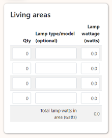<figcaption></figcaption></figure>

### Appliances and Renewables

Use this page to enter details on:

* custom occupancy
* custom energy used for electronic devices such as televisions and computers
* whiteware supplied with the dwelling (if any)
* the type of fuel used for cooking
* on-site renewable energy generation

Note that data entered on this page does not impact credits [HC1](part-2-credits/healthy-and-comfortable/hc1-winter-comfort.md) or [EF4](part-2-credits/efficient/ef4-energy-use.md). However, the contribution of on-site PV (if installed) to reducing the overall carbon emissions use of the home (credit [EN1](part-2-credits/environmentally-responsible/en1-renewable-energy.md)) is calculated based on the inclusion of appliances. This means that the installation of energy efficient appliances will help increase the home’s score in EN1.

The occupancy and appliance data also contributes to the assumed heat gain in [HC2 ](part-2-credits/healthy-and-comfortable/hc2-summer-comfort.md)for summertime overheating. Appropriate occupancy and appliance data must be entered here if known to be different from typical NZ occupancy.

#### Occupancy

ECCHO has a default number of occupants it assumes to be living in the dwelling when calculating the energy used for space-heating, overall energy consumption and for estimating overheating. This number is calculated from the conditioned floor area you define on the Projects page.

The default number of occupants can be changed where the home is known to be occupied differently from the average in New Zealand. Note that the outdoor air assumed for the ventilation system is the greater of 0.35 air changes per hour and 7.5 litres per person as per NZS4303.

Please use the default allowance for occupancy if there is no evidence that the home will be used differently from the norm in New Zealand.

#### Consumer Electronics

This is the total installed load of items such as televisions, laptops and gaming consoles. The total load is assumed to be used on average for 1.5 hours per day. Please use the default allowance for consumer electronics if there is no evidence that the home is to be used differently from the norm in New Zealand.

#### Whiteware

This part of the worksheet includes a table of common appliances found in homes. Where homes have appliances installed at the time of assessment the energy label star rating must be indicated against the relevant appliance. This gives an opportunity to include the energy savings of higher rated appliances.

Where homes are not supplied with all, or some, of the whiteware listed in the table below, these must be left at the default 2 Star rating.

<table data-search="false"><thead><tr><th width="198.99993896484375" valign="top">Appliance</th><th width="240.36376953125" valign="top">Assumed size</th><th width="271.36358642578125" valign="top">Assumed use profile</th></tr></thead><tbody><tr><td valign="top"><strong>Dishwasher</strong></td><td valign="top">15 place setting</td><td valign="top">65 cycles per year per occupant</td></tr><tr><td valign="top"><strong>Washing Machine</strong></td><td valign="top">8 kg capacity</td><td valign="top">57 cycles per year per occupant</td></tr><tr><td valign="top"><strong>Clothes Dryer</strong></td><td valign="top">8 kg capacity</td><td valign="top">25 cycles per year per occupant</td></tr><tr><td valign="top"><strong>Fridge</strong></td><td valign="top">400 litre capacity</td><td valign="top">On all year</td></tr><tr><td valign="top"><strong>Freezer</strong></td><td valign="top">200 litre capacity</td><td valign="top">On all year</td></tr><tr><td valign="top"><strong>Fridge Freezer</strong></td><td valign="top">400/200 litre capacity</td><td valign="top">On all year</td></tr></tbody></table>

#### Renewable Generation

Enter information here on any on-site renewable energy generation systems such as rooftop PV. Please see credit [EN1 ](part-2-credits/environmentally-responsible/en1-renewable-energy.md)in the Homestar manual for details on how to estimate annual generation. &#x20;

### Refrigerants      &#x20;

This page must be filled in where the home includes refrigerants for space heating/cooling and/or hot water, i.e. heat pumps.

<figure>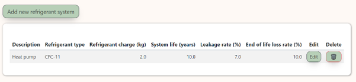<figcaption></figcaption></figure>

Each row represents a system used in the home such as a hi-wall heat pump. Enter a description of the system, the type of refrigerant used and the total refrigerant charge in kg.&#x20;


Note that HFC-32 is the most common refrigerant used in domestic heat pumps in New Zealand and is also known as R32.


There are other editable fields, however they should be entered as the following defaults unless evidence can be found to the contrary:

<table><thead><tr><th width="240.3636474609375">Field</th><th>Default</th></tr></thead><tbody><tr><td>System life, years</td><td>This should be entered as 10 years unless evidence is provided to use another figure</td></tr><tr><td>Leakage rate, %</td><td>This should be entered as 7% unless evidence is provided to use another figure</td></tr><tr><td>End-of-life loss rate, %</td><td>This should be entered as 10% unless evidence is provided to use another figure</td></tr></tbody></table>

## Results

ECCHO offers an overall detailed results page (ECCHO results) and, separately, results for Building Code compliance (NZS4218 results). Click on the Results dropdown in the navigation for these options.

### Homestar/PHPP Results

These pages display the results in several tables including the headline dwelling energy and carbon data and the cooling and overheating data.

The headline dwelling energy and carbon data excludes any energy associated with cooling. This is consistent with Homestar v5, provided that the home has less than 7% of year below 25°C as indicated in the Cooling and overheating data.

<figure>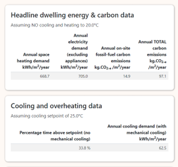<figcaption></figcaption></figure>

<figure>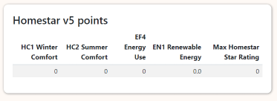<figcaption></figcaption></figure>

The Homestar points are displayed in a separate table for credits HC1, HC2, EF4 and EN1. The table also shows the maximum permitted Star rating based on the minimum expectations in each of the credits.

#### Heat balance chart

The results include a heat balance chart. This has two bar graphs. The first one shows all the heat losses in the home, broken down by walls, windows, roofs, thermal bridges etc. The second one shows heat gains from windows and internal loads (people and appliances). The balance is then the additional heat needed to maintain the required set point temperature.

The chart is useful for determining where the majority of heat losses are coming from.

<figure><figcaption></figcaption></figure>

### Custom Results

At the top right-hand corner of the results page are radio buttons to allow the results pages to toggle between Homestar results and custom results. The Custom results include custom occupancy and appliance heat gains in the overall heating demand, electricity consumption and carbon emissions. Please note that custom results must not be used for Homestar compliance.

### PDF Results

The results page also includes a button to pdf the results together with a summary of all the dwelling data. The PDF opens in a new window where it can be downloaded for your records. Please submit a pdf of the results for any home submitted for Homestar.
