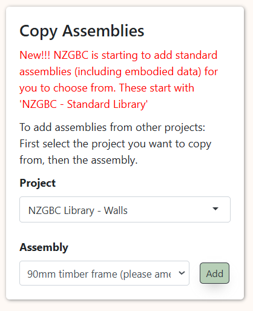
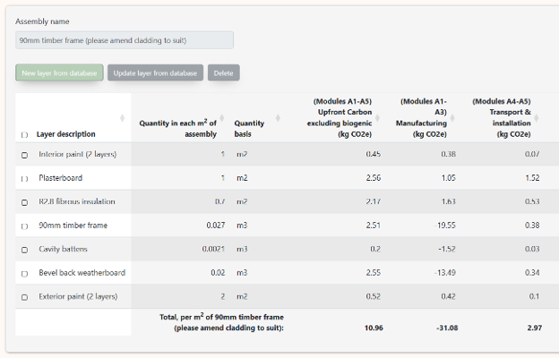
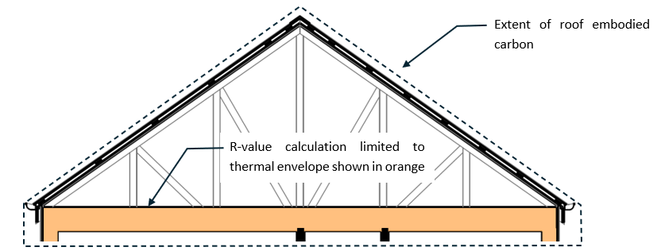
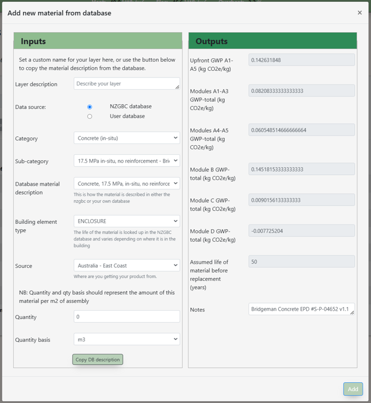
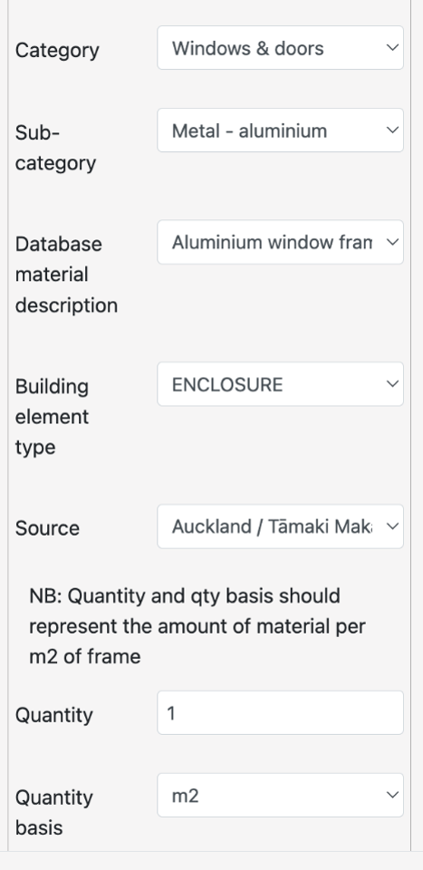
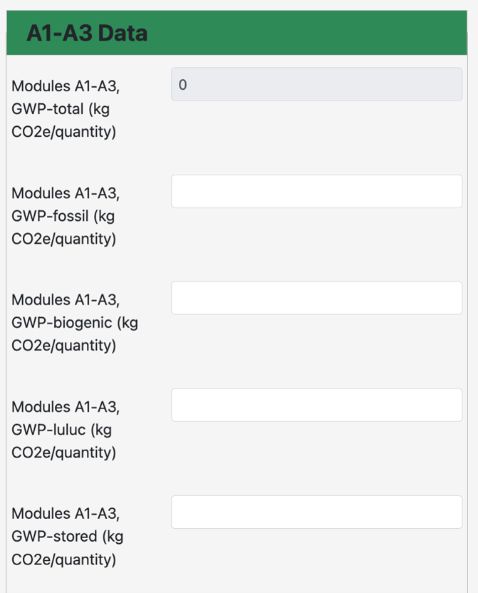
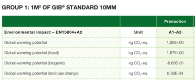
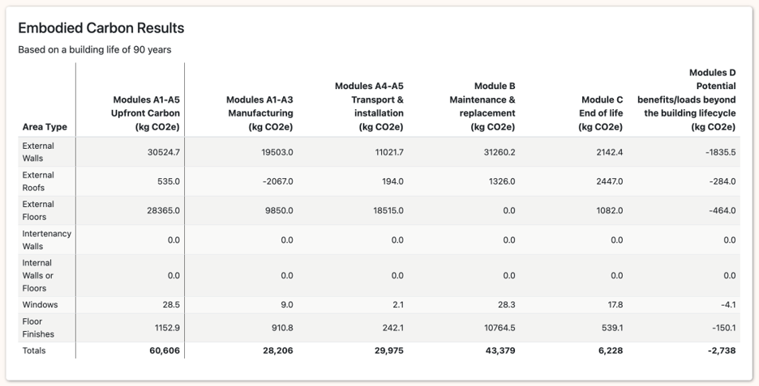
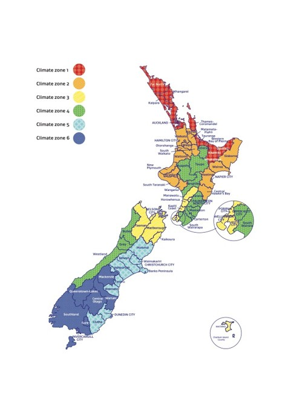

# Appendix C: Guide to Embodied Carbon Modelling in ECCHO

## Introduction to Embodied Carbon Modelling in ECCHO

Since the early release of Homestar version 5, users have had the ability to calculate the embodied impacts of a new home using our Homestar Embodied Carbon Calculator. This spreadsheet is a great, simple, introduction to embodied carbon in homes since it has a big library of embodied impacts for typical roof, wall and floor assemblies meaning designers just need to enter areas of each of these to get a result. This spreadsheet will remain in use for projects for the foreseeable future.

HECC has some limitations however:

1\. The embodied impacts of the layers making up an assembly are "hardcoded" meaning that it is not possible to customise layers, for example swapping out a lower carbon form of insulation or plasterboard from a particular supplier.

2\. It is not possible to build completely new custom assemblies for types that are not currently in HECC, for example SIPS.

3\. Users must enter the areas of walls, floor, roofs and windows in ECCHO and then re-enter these areas in HECC.

To address these issues, ECCHO now includes the ability to calculate embodied (including upfront) emissions in accordance with credit EN2 in Homestar. This means that it is no longer required to enter building dimensions twice, once in ECCHO and then separately in an embodied carbon calculator such as the Homestar Embodied Carbon Calculator spreadsheet.

The following is an outline of how to enter embodied carbon data into ECCHO. It is not intended as a primer on Embodied Carbon or Life Cycle Analysis as a general subject. For users new to embodied carbon NZGBC has an embodied carbon masterclass (typically run 4 times a year) and there are various online introductions to embodied carbon, including MBIE resources available [here](https://www.building.govt.nz/getting-started/climate-change-work-programme/emissions-reduction).

## Structure of Embodied Carbon Calculations in ECCHO

There are 4 fundamental embodied carbon pages in ECCHO as follows:

<table data-header-hidden><thead><tr><th valign="top"></th><th valign="top"></th></tr></thead><tbody><tr><td valign="top">Assemblies</td><td valign="top">Create new wall, floor and roof assemblies. Edit thermal and embodied carbon properties.</td></tr><tr><td valign="top">Glazing and Framing</td><td valign="top">Create new glazing and frame types. Edit their thermal and embodied carbon properties.</td></tr><tr><td valign="top">Miscellaneous Embodied Elements</td><td valign="top">Add embodied carbon for elements not covered by assemblies or windows/doors. This includes, for example, rooftop PV.</td></tr><tr><td valign="top">User Embodied Carbon Database</td><td valign="top">Add your own embodied carbon data for products or materials not already in NZGBC's database.</td></tr></tbody></table>

## Assemblies

The _assemblies_ page is where internal and external wall, roof and floor assemblies are defined. These assemblies are the building blocks of ECCHO. In the operational calculator they are used to calculate and define the thermal properties. In the embodied calculator this page is used to calculate the embodied impact of 1m2 of assembly. This is then multiplied by the total area of each assembly to calculate the overall embodied impact.

<figure><figcaption>
Standard assemblies can be imported from NZGBC's library.
</figcaption></figure>

### NZGBC library

One great advantage of HECC is that it has a comprehensive library of standard assemblies. NZGBC will be adding the HECC library of assemblies to ECCHO in the early part of 2025. This will substantially reduce the time required to do embodied carbon analysis for Homestar.

Standard NZGBC assemblies are available from the ‘copy assemblies’ box. Pick projects beginning with ‘NZGBC library’ to find the assembly you’d like to copy into your project.

### Creating a new assembly

Start by creating a new assembly as you would for the operational energy calculation. Assemblies can be custom or detailed.

Once an assembly has been created, you can then click on ‘edit embodied’ to define all the layers that make up that assembly.

The screenshot below shows a typical assembly built up in the Assembly Embodied Emissions page. The example shown is a 90mm standard timber stud wall, consisting of interior paint. plasterboard (GIB), insulation, framing timber, cavity battens and painted exterior weatherboards.

The quantities that have been entered represent the amount of that material in 1m2 of that assembly on average. So 1m2 of 90mm wall would contain 1m2 of plasterboard and 0.027m3 of timber frame assuming an average timber content on 30%, i.e. 30% x 1m2 x 0.09 (90mm).

The embodied impacts of 1m2 of this assembly (as calculated in the assembly page) is then multiplied by the total area of that assembly in the dwelling.

<figure><figcaption>
Typical embodied carbon layers of an assembly.
</figcaption></figure>

NB: For now, any layers that are defined in the detailed R-value page are not copied across to the embodied page so these will need to be added again. We may link these in a future update.

### Elements that must be included in an Assembly

Note that a typical 90mm wall would include many more detailed components such as nails, glues and fasteners. These minor components can be excluded. The table below sets out the level of detail that is required for a Homestar submission.



<table><thead><tr><th valign="top">Walls</th><th>Roofs</th><th>Suspended Timber Floors</th><th>Concrete Floor Slabs</th></tr></thead><tbody><tr><td valign="top"><ul><li>Cladding</li><li>Structural framing</li><li>Internal linings (e.g., GIB)</li><li>External paint (e.g., applied to weatherboards, if included)</li><li>Internal paint</li><li>Cavity Battens</li><li>Insulation</li></ul></td><td><ul><li>Cladding</li><li>Structural framing</li><li>Ceiling lining</li><li>Internal paint</li><li>Insulation</li><li>Purlins</li></ul></td><td><ul><li>Flooring</li><li>Structural framing (joists, bearers, piles)</li><li>Pile footings</li><li>Subfloor linings.</li><li>Insulation</li></ul></td><td><ul><li>Concrete (slab and footings)</li><li>Reinforcing steel</li><li>Basecourse/fill</li><li>Underslab insulation (e.g., EPS)</li><li>Edge protection</li><li>Membranes (e.g., DPC)</li></ul></td></tr></tbody></table>



<table><thead><tr><th valign="top">Walls</th><th>Roofs</th><th>Suspended Timber Floors</th><th>Concrete Floor Slabs</th></tr></thead><tbody><tr><td valign="top"><ul><li>Internal paint applied to cornice and skirting.</li><li>Exterior primer</li><li>Cornice</li><li>Interior primer</li><li>Cavity vent strips</li><li>Building wrap</li><li>Skirting</li><li>Fixing straps</li><li>Adhesives</li><li>Fixings</li></ul></td><td><ul><li>Interior primer</li><li>Building wrap</li><li>Adhesives</li><li>Fixings</li></ul></td><td><ul><li>Membranes</li><li>Adhesives</li><li>Fixings</li></ul></td><td><ul><li>Sand blinding</li><li>Flashings</li><li>Edge insulation</li><li>Formwork</li><li>Accessories to slab (e.g., bar chairs, wire)</li><li>Adhesives</li></ul></td></tr></tbody></table>




This Is a broad guideline for materials that MUST be included or may be excluded in the embodied carbon analysis so that at least 95% of the total embodied carbon of the dwelling/project is accounted for.


### Components outside the thermal envelope

For an R-value calculation only elements _inside_ the thermal envelope are included. For example, cladding _outside_ the ventilated cavity would typically be excluded, as would all elements above the insulation line in a vented roof cavity (e.g. roof cladding, purlins and trusses).

For embodied carbon ALL major elements must be included. The diagram below shows the scope of the R-value calculation compared with the scope of the embodied calculation for a typical truss roof. Note how the elements above the insulation like are included in the assessment.

<figure><figcaption>
Scope of embodied carbon includes layers outside the thermal envelope.
</figcaption></figure>

#### Adding layers

The screenshot below shows the dialogue box for adding new layers to an assembly. The left side (inputs) is where you select the product or material making up the layer. The right side (outputs) shows the embodied carbon impact of that product or material from the database. The units are kg.CO2e _per kg_ of that product or material.

<figure><figcaption>
Screenshot of layer entry dialogue.
</figcaption></figure>

The following summarises what each of the inputs does:

Layer description

Give your layer a name. This could be, for example, 10mm plasterboard. There is a button at the bottom of the page. This will copy the full text of the database entry into your project should you wish to use this as your layer name.

Data source

Data can come from the comprehensive database or your own database. Note that user-supplied data must be backed up with evidence (e.g. EPD) for Homestar certification.

Category/sub-category

The materials database is classified into categories and sub-categories. Use this to find your data.

Database material description

Final detailed description of the data on which the embodied impacts is based.

Building element type

Where in the building is this element located. The embodied carbon database sets different life rates for products and materials based on where they are located. For example, timber used as part of the enclosure is assumed to have a 60 year life, whereas it is assumed to last 100 years when part of a structure.

Source

Where is the product or material being sourced from.

Note that EPD data will usually be from raw material extraction to factory gate, so the location is where the final product is made. This means for example, that even if a glazing unit is imported from abroad, an EPD for a New Zealand made window will already include transport impacts for the imported glazing unit and the 'location' is therefore the location of the New Zealand window factory.

Quantity

How much of this product or material is in 1m2 of the assembly. Note that some quantities will be variable across an actual area of assembly. For example, the quantity of truss is clearly greater in the centre of the roof than at the edges. In this case, take a roof area for an exemplar house, calculate the total quantity of this element in the entire roof area and then divide by the plan area of that roof (within the thermal envelope). For this reason, the quantity of roof cladding in 1m2 of roof will generally be greater than 1m2 because of the pitch of the roof and any eaves.

Quantity basis

What are the units for the quantity you have entered. This will generally be m2 for products and materials in an assembly, but not always. Timber frames will generally be expressed volumetrically.

Notes

These notes are pulled in from the database but can be overridden or supplemented with extra data to support your Homestar submission.

## Glazing and Frames

As with assemblies, ECCHO allows users to define glazing and frame types, before going on to build windows using those glazing and frame types in the Window and Door areas page. The Glazing and Frames page now includes the ability to define the embodied impact of each glazing and frame _type_. This is then multiplied by the area of glazing and framing in the project to calculate the total embodied impact of windows and doors.

<figure><figcaption>
NZGBC database has standard data for aluminum, uPVC and timber frames.
</figcaption></figure>

ECCHO includes a number of standard glazing and frames types. These have embodied carbon data pre-entered.

As with assemblies, the data entered into the glazing and framing pages represents the amount of that material in 1m2 of glazing or frame.

The NZGBC database has some generic glazing and frame data that can be used in most cases. On the right is an example of embodied impacts for a generic aluminium window frame from the database.

Some window suppliers in New Zealand have Environmental Product Declarations (EPDs) for their windows (glazing + frame). This data may be used. Simply specify the same data for both the window and frame. This way ECCHO will apply this across the full area of the window.

If the window supplier data does not yet exist in the NZGBC database simply enter it into your own personal database (see below) and then import it into your glazing and framing. Don’t forget to provide the supplier EPD in your Homestar evidence pack.

## Miscellaneous embodied elements

This page allows users to add additional embodied impacts from elements of the dwelling that are not part of an assembly or window. This would include:

·         Renewable energy generation such as rooftop PV

·         Floor finishes such as carpet (this is reported separately)

·         Slab edge insulation

Users are invited to specify a “grouping” for the data. For Homestar projects we would expect to see floor finishes and (if present) renewable energy generation.

The standard groupings also include walls, floors and roofs. Extra data can be added to these where embodied impacts aren’t a function of the area of these. Examples of this would be slab edge insulation or some unusual roof element.

## User Embodied Carbon Database

ECCHO draws on NZGBC’s own embodied carbon database (available [here](https://nz-embodied-database-e6a0b1330b9a.herokuapp.com/viewdata)). This is a collection of well over 1,000 products and materials with their embodied impacts drawn from Environmental Product Declarations among other sources. The origin of this database is the BRANZ CO2NSTRUCT data.

However, no database can be comprehensive so we recognise that users should have the ability to add their own data. The User Embodied Carbon Database page is therefore provided to allow users to add products and materials that have not yet been added to NZGBC’s own dataset. Note that for Homestar submissions any data used needs to be evidenced, for example by including the pdf of the EPD for that product or material.

EPDs often include embodied carbon impacts from cradle-to-grave (i.e. they include the end of life impacts) or even cradle-to-cradle (including module D).

<figure><figcaption>
Only A1-A3 data is required for user-defined materials.
</figcaption></figure>

In order to standardise how the data for these later life stages is calculated (it is highly variable in EPDs, unfortunately) ECCHO calculates this lifecycle data for you based on the basic material type. For this reason, it is only necessary to provide the cradle-to-factory-gate data, i.e. modules A1-A3 as shown on the right. This data is broken up into fossil carbon, biogenic carbon, land-use-and-land-use change and carbon stored.

Apart from stored carbon, EDPs generally show this data clearly in tables. See example for GIB plasterboard below. Note that EPDs often show the data with exponentials (i.e. 1.20E+00). This may be copied and pasted directly into the input and ECCHO will know how to convert this into a normal number.

Stored carbon is not measured in Homestar or used (yet) in ECCHO so may be left blank. For expert users please refer to the NZGBC embodied carbon methodology for more details on stored carbon. For long-lived timber based products stored carbon is essentially identical to biogenic carbon.

<figure><figcaption>
Example EPD data showing total, fossil, biogenic and luluc impacts.
</figcaption></figure>

In addition to the embodied carbon impacts please also provide:

Product description

Give your product or material a name.

Category/sub-category

Classify your data so you can find it again.

Quantity basis

What quantity is your embodied carbon data based on? This will typically be clearly set out in an EPD. For example, for windows, the emissions will be for 1m2 of window area, so your quantity basis will be m2.

Waste and life material type

The NZGBC database has a table of typical end-of-life scenarios for different material types. This is used to calculate the end-of-life carbon for your product or material. Please select the most appropriate material type, e.g. uPVC would come under ‘plastic’.

Density

Life cycle carbon assessments are generally carried out ‘under the hood’ based on the total weight (kg) of product. This is because end-of-life and transport impacts are based on this. For example, trucking and shipping the product to site is calculated based on the average carbon emissions per tonne of product transported per km.

For this reason, ECCHO needs to be able to convert your units into kg and therefore needs a corresponding density.

ECCHO has density inputs for volumetric density (kg/m3), area density (kg/m2), linear density (kg/m) and unit density (kg/unit). As a minimum you must provide a density corresponding to your quantity basis. So if the quantity basis is m2 (as the window example above) you must provide an area density.

You may provide other densities, if known, and this will allow users to enter data for your product based on these other units.

Custom recycled content

What fraction of your product’s content is made from recycled material? Generally this is zero and can be left blank.

Data validity dates

This data is optional, but does help you remember if the EPD on which the data is based is about to expire.

## Results

The summarised Embodied Carbon results can be found at the bottom of the Homestar/Custom results page. This shows the embodied carbon grouped into the different areas (roofs, walls, floors) and any additional groupings you have provided in the Miscellaneous Embodied Carbon page.

The first column of results is Upfront Carbon (modules A1-A5). This is the carbon associated with products and materials from raw material abstraction to practical completion and is the basis on which points are awarded in credit EN2 in Homestar.

<figure><figcaption>
Results page. In Homestar credit EN2 points are based on total upfront carbon (kg.CO2e/m2).
</figcaption></figure>

## Climate Zones and Districts

Homestar v5 divides Aotearoa New Zealand into six climate zones. These are aligned with climate zones outlined in the New Zealand Building Code Clause H1 update proposed in 2021.

The table below sets out the climate zones on which benchmarks are based for credits EF4, HC1, and HC4. The districts within each zone are listed after:

<table><thead><tr><th width="86.272705078125" align="center">Zone</th><th width="497.272705078125">Districts</th><th>ECCHO Locations</th></tr></thead><tbody><tr><td align="center">1</td><td>Far North, Whangarei, Kaipara, Rodney, Auckland, Papakura, Franklin, Thames-Coromandel, Western Bay of Plenty, Tauranga, Whakatane, Kawerau, Opotiki</td><td>Auckland, Kaitaia, Tauranga</td></tr><tr><td align="center">2</td><td>Gisborne, Wairoa, Hastings, Napier City, Central Hawkes Bay, New Plymouth, South Taranaki, Whanganui, Hauraki, Waikato, Matamata-Piako, Hamilton City, Waipa, Otorohanga, South Waikato, Waitomo, Stratford</td><td>Napier, New Plymouth, Hamilton/Ruakura, Paraparaumu</td></tr><tr><td align="center">3</td><td>Manawatu, Palmerston North City, Horowhenua, Kapiti Coast, Porirua City, Hutt City, Wellington City, Tasman, Nelson City, Marlborough, Kaikoura</td><td>Nelson, Wellington, Chatham Islands</td></tr><tr><td align="center">4</td><td>Taupo, Rotorua, Ruapehu, Rangitikei, Tararua, Masterton, Carterton, South Wairarapa, Buller, Grey, Westland, Upper Hutt City</td><td>Rotorua, Hokitika, Masterton, Turangi</td></tr><tr><td align="center">5</td><td>Hurunui, Waimakariri, Christchurch City, Selwyn, Ashburton, Timaru, Waimate, Dunedin City, Clutha, Banks Peninsula</td><td>Christchurch, Dunedin</td></tr><tr><td align="center">6</td><td>Mackenzie, Waitaki, Central Otago, Queenstown Lakes, Southland, Gore, Invercargill City</td><td>Invercargill, Lauder, Queenstown</td></tr></tbody></table>

<figure><figcaption></figcaption></figure>
