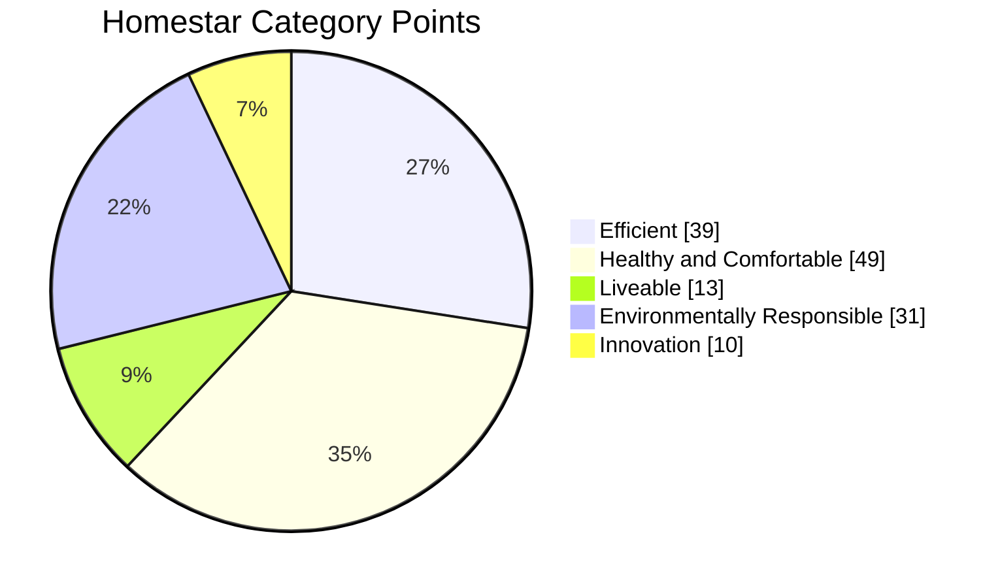

# How Homestar Works

## Eligibility

The Homestar tool allows all types of dwellings to be rated. To be assessed, a dwelling must be considered as being ‘self-contained’ with the following minimum requirements:

* At least one bathroom with toilet and shower or bath.
* At least one kitchen or kitchen area which must include a cooking appliance (e.g. oven, stove, microwave), a food preparation area and food storage space.
* Constructed on permanent foundations.


More information about minimum requirements for dwellings, including sizes of kitchen areas (Clause 7) and bedrooms (Clause 8) can be found in the Housing Improvement Regulations 1947, [http://www.legislation.govt.nz/regulation/public/1947/0200/latest/DLM3505.html](http://www.legislation.govt.nz/regulation/public/1947/0200/latest/DLM3505.html)


## Categories

The Homestar tool is divided into four categories that form the key foundations of Homestar. Within each category are credits that address specific areas relating to that category.

### Efficient&#x20;

This category rewards smaller dwellings and residential developments with smaller footprints that consequently require fewer resources to build, operate and occupy, and attributes that contribute to a reduction in energy and water use within the dwelling.&#x20;

### Healthy and Comfortable&#x20;

Rewards dwelling attributes that contribute to occupant comfort and health, such as ventilation, moisture control, acoustics, and natural light. It also recognises interior finishes that minimise the detrimental impact on occupant health from products that emit pollutants such as Volatile Organic Compounds (VOCs).

### Liveable&#x20;

Rewards safe, secure and adaptable dwellings.

### Environmentally Responsible&#x20;

Rewards dwelling attributes that contribute to having a lower environmental impact through responsibly sourced materials, effective stormwater management and measuring and reducing embodied carbon.

## Points and Star Bands

Homestar rates a home on a scale of 1 to 10 stars; however, only those achieving a 6 to 10 Homestar Rating can be ‘certified’. These stars correspond to the total number of points achieved against the Homestar credit criteria within each category, as well as the mandatory minimums met. There is a total of 132 points available within the tool for apartments and terraces, and - 130.5 for standalone homes, as well as 10 innovation points.

<table><thead><tr><th width="175.81817626953125" align="center">Rating</th><th width="204.90911865234375" align="center">Minimum Points</th></tr></thead><tbody><tr><td align="center">6</td><td align="center">60</td></tr><tr><td align="center">7</td><td align="center">70</td></tr><tr><td align="center">8</td><td align="center">80</td></tr><tr><td align="center">9</td><td align="center">90</td></tr><tr><td align="center">10</td><td align="center">100</td></tr></tbody></table>

The assigned weight of each category (i.e. the number of points allocated to each category) was developed in consultation with the Expert Reference Panel (ERP) and in consideration of national and international precedents set within other relevant frameworks. The weightings have been fine-tuned to reflect the New Zealand built environment and the objectives of Homestar.

See [credit summary](../part-2-credits/credit-summary.md) for points breakdown.

To ensure a baseline standard, several key areas have mandatory minimum levels that must be achieved for a particular star rating. These mandatory minimum levels are outlined in the section titled “Mandatory Minimums”.

## Types of Homestar Assessments

### Design Rating

A full assessment of a proposed dwelling based on detailed plans, specifications and any other documentation required to fully describe the build. A Design Rating is a checkpoint on the path to a Homestar Built Rating and expires two years after being issued.

### Built Rating

A physical inspection of a completed dwelling by the Homestar Assessor. It can be conducted on an existing property without a prior Homestar Design Rating. If a Homestar Design Rating has been completed, the documentation may be used to streamline the process for a Homestar Built Rating.

### Homestar Ready Design

Where a developer has standard house designs and specifications, aspects of these designs relating to various Homestar credits may be pre-assessed. Homestar Ready designs can be re-used for subsequent projects within applicable climate zones.

## Types of Homestar Professionals

NZGBC trains and accredits industry professionals to promote Homestar within the market, advise home builders and owners on what the scheme entails, design homes to meet Homestar requirements, and carry out assessments. There are two professional accreditations:

### Homestar Designer&#x20;

Homestar Designers are trained to design and advise on the technical aspects of Homestar and the principles of sustainable design, so that they can apply this knowledge when working on a Homestar project. Homestar Designers are taught and have access to use the Energy and Carbon Calculator for Homestar (ECCHO) modelling tool.

### Homestar Assessor&#x20;

Homestar Assessors are responsible for compiling and submitting a project to NZGBC ready for auditing and certification. A Homestar project can only be submitted by an accredited Homestar Assessor.&#x20;

_The Homestar Practitioner accreditation no longer exists. It has now been replaced by the Homestar Fundamentals course which provides useful background information about the Homestar tool and is a prerequisite for the other courses but is not a formal accreditation. However, professionals with this previous accreditation are still recognised and points can be claimed for having this qualification in the relevant credit._

### Homestar Auditors

Homestar assessments submitted to NZGBC are audited prior to the rating being confirmed. Experienced Homestar Assessors may be invited to become Homestar Auditors.
