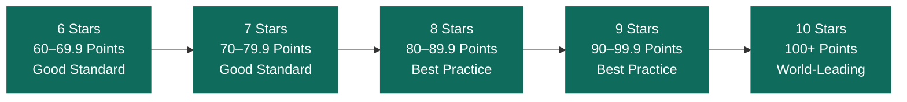

# Introduction to Homestar

## Homestar Background

The rating tool was released in 2009 as a result of a joint venture between BRANZ, Beacon Pathway and the New Zealand Green Building Council (NZGBC) for existing and new dwellings in New Zealand. It is now operated solely by the NZGBC. Based on a number of successful international rating tools, it was developed for Aotearoa’s specific conditions in consultation with an Expert Reference Panel made up of industry professionals. The tool is periodically updated in response to industry feedback and development, leveraging on the expertise of stakeholders across the industry.

## Aims and Objectives of Homestar

The overarching objective of the Homestar rating tool is to improve the performance and environmental impact of new and renovated New Zealand dwellings, making them warm, healthy, comfortable places to live. This also helps Aotearoa achieve its obligations under the Paris Climate Accord. To this end, the Homestar rating tool aims to:

1. Establish a common language and standard of measurement for efficient, comfortable, healthy homes.&#x20;
2. Address key sustainability issues faced by New Zealand such as construction waste, as well as housing quality issues such as inadequate heating and ventilation.&#x20;
3. Provide advice that enables the building and construction industry to produce targeted solutions that deliver results for owners and tenants.&#x20;
4. Create a value proposition for investment into the attributes that improve the performance of New Zealand dwellings, by rewarding good design with a higher rating.&#x20;
5. Raise awareness of the benefits of sustainability for owners and tenants and the construction industry.

A formal certified rating carried out by a Homestar Assessor shows exactly how a home rates across several sustainability criteria on a scale of 6 stars to 10 stars.

