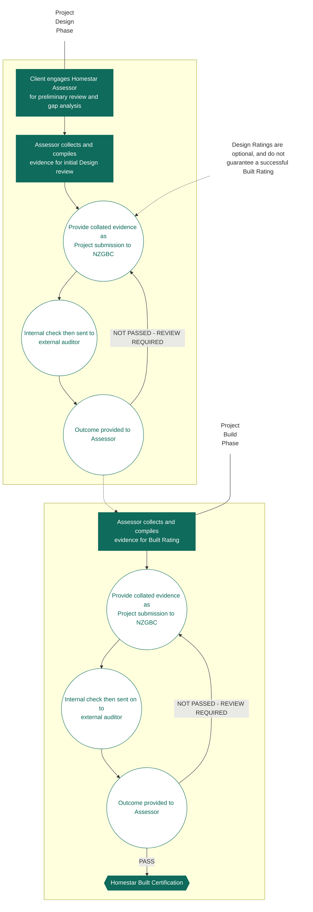

# The Homestar Process

## Registration

The first step in the Homestar process should be to contact a Homestar Assessor to discuss the viability of the Project. The Project will then need to be registered online at www.nzgbc.org.nz - this can be done by the client, or a representative - which can be the Homestar Assessor.&#x20;

For large (30 or more dwellings) or complex (10 or more typologies) projects, consulting with NZGBC prior to registration is recommended.

## Admin and Audit Fees

Each Project is invoiced an all-in NZGBC fee. This fee includes all NZGBC administration, processing and certification within the standard pipeline; and is determined by the count of typologies and dwellings in the Project.

Each Project is allowed two submission rounds for Design, and two submission rounds for Built. Note that Design submissions are optional, and do not generate a dwelling certification.

There may be additional costs for the following extras:

* Project amendments
* Energy modelling audits
* Technical Questions
* Additional audit rounds

## Compiling a Submission

It is necessary to collect documentation to evidence the points claimed for the Homestar rating. The documentation requirements are noted in each credit, along with whether that documentation needs to be submitted with your assessment.

Submitting an Assessment

The Homestar Assessor must collate all the required audit documentation within the relevant credits in the Homestar submission folder and submit this, along with the completed Homestar scorecard and calculators, to NZGBC for audit. Please refer to Appendix G for further information on how to compile a good submission.

Proforma of Credit Compliance

Rather than submitting evidence, the Homestar Assessor may confirm compliance with the credit criteria by using the Pro forma of Credit Compliance for the following credits: HC6, LV2, LV3, LV4, EN1 and EN6. The Pro forma also includes a mandatory section for onsite flow rate testing for EF3.
\
If the Assessor does not wish to use the Pro forma, they may instead choose to provide the evidence listed for relevant credits in the Pro forma.

Audit Process

NZGBC is responsible for ensuring each assessment has been completed accurately and is consistent with Homestar Assessor guidance provided within the Homestar Technical Manual through an independent audit process. This is a desktop audit and not a peer review of the submission.

Two submission rounds are permitted so that the Assessor may submit further evidence or address any identified issues. If a third or subsequent rounds are required, these are charged as per the ‘audit’ component of the Homestar admin and audit fee.

The general principle applied to audit is that the Homestar Assessor takes responsibility for ensuring:

* All required documentation is included and is up to date.
* The submission contains the relevant documentation (highlighted or indicated as appropriate).
* The documentation is organised in an efficient filing structure with concise file names.

The role of the Auditor is to check that the supplied documentation meets the requirements of the Homestar Technical Manual. The general principles applied to audit are:

* The submission is complete, with accurate, relevant and precise information.
* Sufficient work is undertaken to verify that the documentation meets the credit requirements.
* Audits are handled confidentially and consistently across all projects.

Should the submission be deemed insufficient or incomplete, NZGBC will respond to the Assessor with questions. If a submission is deemed grossly insufficient, the Auditor may reject the submission without fully scrutinising all credits and request a fresh submission.

## Audit Results

Following each audit round, the Homestar Auditor will provide responses to the Assessor in the following format:

### Confirmed

All required documents have been submitted for the credit reviewed and based on these documents, points have been awarded correctly.

### Confirmed with Comments

The submission contained documentation or interpretation errors for the credit reviewed that do not affect the points awarded in the credit but need to be noted for future assessments.

### Not Confirmed

Submission contains significant errors that affect the points awarded. The Assessor is to review the credit and alter/award points accordingly. If points still have not been confirmed at the end of the second audit round, a Homestar Assessor may apply for a Charged Credit Review.

## Rating Adjustment

If a submission contains a significant number of not confirmed credits, a rating adjustment (i.e. change in star rating) may be required. Should this occur, and the Assessor is not
&#x20;satisfied with the resulting rating, they will be given the opportunity to appeal against the decision at their own cost. Any projects that fail to achieve a 6 Homestar rating will be recorded against the Assessor. If this occurs on multiple occasions during a single accreditation cycle, the Assessor will be required to complete further training before they may renew their qualification.
