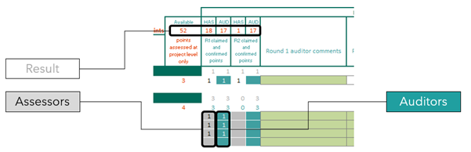

# Using the Homestar Tool

## The Homestar Scorecard

The Homestar Scorecard enables Assessors to record points awarded for credits, for Auditors to confirm or deny those points, and for both Auditors and Assessors to comment or respond to comments.

The scorecard comes in two parts:

* Project-wide credits scorecard: complete only once for each project.
* Typology-based credits scorecards: complete for each typology within the project.

Both parts of the scorecards have the Design Rating section on the right covering two rounds and the Built Rating section on the left covering two rounds. The awarded and confirmed points, as well as the comments for each round and rating stage, are on one page to allow the Auditor to easily reference previous rounds and stages.

The total points claimed by the Assessor and/or confirmed by the Auditor at each round is shown at the top of each typology-based credits scorecard. This total includes the points claimed/confirmed for project-wide credits as well.

## Coversheet and Change Log

The scorecard file also includes a change log and a coversheet where general project details such as location can be entered, the points for EF2: Urban Density can be calculated, and where the point summary for the whole project across all typologies can be seen.

## Completing the Scorecards

Points for EF2: Urban Density are transferred automatically to the project-wide credits scorecard. Given the limitations of MS Excel, this means that all rating stages and rounds will show the points currently claimed, not what was claimed at that stage. However, due to the nature of the credit, this is unlikely to change across stages.

For all other credits, all values must be entered manually, including the points calculated using the provided calculators. This allows the same calculator file to be used across all stages and audit rounds while ensuring that the points recorded for past auditing rounds do not automatically change. It also ensures cross-platform reliability and performance.

In general:

* Grey cells can be modified by Assessors.
* Green cells may be modified by the Auditor only.

The Auditor will award some or all the points in the Point Award column. If points are awarded despite all required evidence not being sighted, the Auditor may select No in the All Evidence Sighted column to notify the Assessor. This may be used when outstanding evidence is expected at the next rating stage.

The Auditor will then write comments, and these are highlighted using a traffic light system.

<figure><figcaption></figcaption></figure>

The final points tally, both targeted by the Assessor and awarded by the Auditor, and the Star Rating can be seen at the bottom of the scorecard. You can also see the mandatory minimum milestones, which help both the Auditor and Assessor verify whether the mandatory minimums have been met.

## Homestar Calculators

Homestar Calculators are provided to assist with calculating points for certain credits. Where a calculator is used, the calculated points still need to be transferred manually to the appropriate scorecard.

### Energy and Carbon Calculator for Homes (ECCHO)

ECCHO is a comprehensive, whole-house, thermal performance and carbon calculation tool based on the Passive House Planning Package (PHPP), developed by the German Passive House Institute. This tool forms the primary compliance pathway for several credits.

Refer to [Appendix B](../appendix-b-guide-to-operational-energy-modelling-in-eccho.md) for guidance on how to use ECCHO. ECCHO allows you to see how your current design performs and to experiment with different variables that influence energy demand and emissions, from walls, roofs, floors, and windows through to size, orientation, heating, and hot water systems.

### Homestar Embodied Carbon Calculator (HECC)

HECC is an embodied carbon calculator for standard constructions used commonly in NZ residential construction, developed for NZGBC by BRANZ.

### Other Calculators

NZGBC also provides an Excel-based Homestar Calculation Tool that includes the following:

| Sheet                             | Credits                          |
| --------------------------------- | -------------------------------- |
| Summary                           | EF1                              |
| Overheating Risk Checklist        | Determines eligibility for ECCHO |
| Water Calculator                  | EF3, EN5                         |
| Daylight Calculator               | HC5                              |
| Materials Calculator              | EN3, HC7                         |
| Adaptation & Resilience Checklist | LV5                              |

#### Homestar Calculators by Credit

| Credit Name                    | Calculator Used                | Location                  |
| ------------------------------ | ------------------------------ | ------------------------- |
| EF1: Resource Efficiency       | Coversheet                     | Homestar Scorecard        |
| EF2: Urban Density             | Coversheet                     | Homestar Calculation Tool |
| EF3: Water Use                 | Water Calculator               | Homestar Calculation Tool |
| EF4: Energy Use                | ECCHO or other\*               | ECCHO                     |
| HC1: Winter Comfort            | ECCHO or other\*               | ECCHO                     |
| HC2: Summer Comfort            | ECCHO or other\*               | ECCHO                     |
| HC5: Natural Lighting          | Daylight Calculator or other\* | Homestar Calculation Tool |
| HC7: Healthy Materials         | Materials Calculator           | Homestar Calculation Tool |
| EN1: Renewable Energy          | ECCHO                          | ECCHO                     |
| EN2: Embodied Carbon           | HECC or other\*                | HECC or other             |
| EN3: Sustainable Materials     | Materials Calculator           | Homestar Calculation Tool |
| EN5: Site Water and Ecology    | Water Calculator               | Homestar Calculation Tool |
| LV5: Adaptation and Resilience | Climate Change Checklist       | Homestar Calculator Tool  |

\*See the relevant credit for details on alternative pathways.

## Credits

Each Homestar credit within the four categories is set out in a consistent manner:

1. **Credit Title**: name of the credit.
2. **Summary Table**: contains points, mandatory minimums, aim, whether it is project-wide, and if there is a calculator available.
3. **Credit Criteria**: benchmarks or requirements to achieve points for the credit, along with associated points.
4. **Evidence**: documentation required to be submitted for both Design and Built Ratings.
5. **Assessment**: instructions for assessing the credit.
