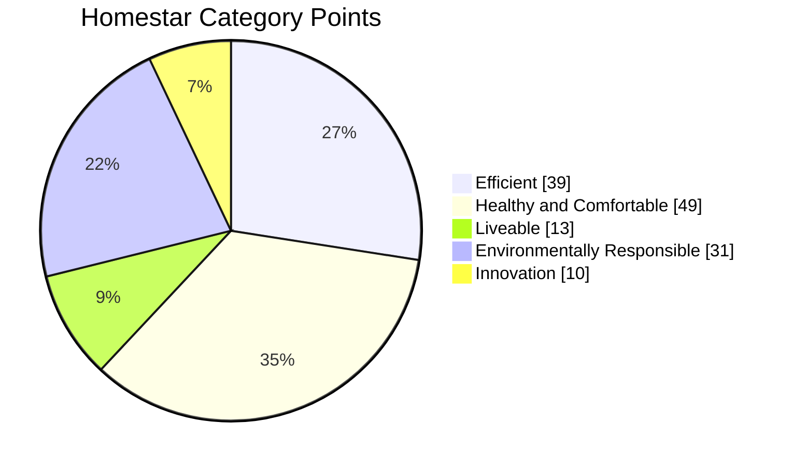

# Credit Summary

Efficient

<table><thead><tr><th width="99.727294921875">Code</th><th width="399.63641357421875">Credit</th><th width="93.5455322265625">Points</th><th width="126.00006103515625">Project Wide</th></tr></thead><tbody><tr><td><a href="efficient/ef1-resource-efficiency.md">EF1</a></td><td>Resource Efficiency</td><td>4</td><td><i class="fa-xmark">:xmark:</i></td></tr><tr><td><a href="efficient/ef2-urban-density.md">EF2</a></td><td>Urban Density</td><td>3</td><td><i class="fa-check">:check:</i></td></tr><tr><td><a href="efficient/ef3-water-use.md">EF3</a></td><td>Water Use</td><td>12</td><td><i class="fa-x">:x:</i></td></tr><tr><td><a href="efficient/ef4-energy-use.md">EF4</a></td><td>Energy Use</td><td>20</td><td><i class="fa-x">:x:</i></td></tr></tbody></table>

Healthy and Comfortable

<table><thead><tr><th width="99.63641357421875">Code</th><th width="399.727294921875">Credit</th><th width="90.63623046875" data-type="number">Points</th><th width="131.636474609375">Project Wide</th></tr></thead><tbody><tr><td><a href="healthy-and-comfortable/hc1-winter-comfort.md">HC1</a></td><td>Winter Comfort</td><td>22</td><td><i class="fa-x">:x:</i></td></tr><tr><td><a href="healthy-and-comfortable/hc2-summer-comfort.md">HC2</a></td><td>Summer Comfort</td><td>6</td><td><i class="fa-x">:x:</i></td></tr><tr><td><a href="healthy-and-comfortable/hc3-ventilation.md">HC3</a></td><td>Ventilation</td><td>5</td><td><i class="fa-x">:x:</i></td></tr><tr><td><a href="healthy-and-comfortable/hc4-moisture-control.md">HC4</a></td><td>Moisture Control</td><td>6</td><td><i class="fa-x">:x:</i></td></tr><tr><td><a href="healthy-and-comfortable/hc5-natural-light.md">HC5</a></td><td>Natural Light</td><td>3</td><td><i class="fa-x">:x:</i></td></tr><tr><td><a href="healthy-and-comfortable/hc6-acoustic-performance.md">HC6</a></td><td>Acoustic Performance - Standalone</td><td>1.5</td><td><i class="fa-x">:x:</i></td></tr><tr><td><a href="healthy-and-comfortable/hc6-acoustic-performance.md">HC6</a></td><td>Acoustic Performance - Attached</td><td>3</td><td><i class="fa-x">:x:</i></td></tr><tr><td><a href="healthy-and-comfortable/hc7-healthy-materials.md">HC7</a></td><td>Healthy Materials</td><td>4</td><td><i class="fa-check">:check:</i></td></tr></tbody></table>

Liveable

<table><thead><tr><th width="99.72723388671875">Code</th><th width="399.63641357421875">Credit</th><th width="99.818359375" data-type="number">Points</th><th width="131.5450439453125">Project Wide</th></tr></thead><tbody><tr><td><a href="liveable/lv1-inclusive-design.md">LV1</a></td><td>Inclusive Design</td><td>3</td><td><i class="fa-x">:x:</i></td></tr><tr><td><a href="liveable/lv2-occupant-amenities.md">LV2</a></td><td>Occupant Amenities</td><td>2</td><td><i class="fa-check">:check:</i></td></tr><tr><td><a href="liveable/lv3-eco-friendly-living.md">LV3</a></td><td>Eco-Friendly Living</td><td>2</td><td><i class="fa-check">:check:</i></td></tr><tr><td><a href="liveable/lv4-sustainable-transport.md">LV4</a></td><td>Sustainable Transport</td><td>4</td><td><i class="fa-check">:check:</i></td></tr><tr><td>LV5</td><td>Adaptation and Resilience</td><td>2</td><td><i class="fa-check">:check:</i></td></tr></tbody></table>

Environmentally Responsible

<table><thead><tr><th width="99.7271728515625">Code</th><th width="399.63616943359375">Credit</th><th width="99.818115234375" data-type="number">Points</th><th width="139.72747802734375">Project Wide</th></tr></thead><tbody><tr><td><a href="environmentally-responsible/en1-renewable-energy.md">EN1</a></td><td>Renewable Energy</td><td>4</td><td><i class="fa-check">:check:</i></td></tr><tr><td>EN2</td><td>Embodied Carbon</td><td>6</td><td><i class="fa-check">:check:</i></td></tr><tr><td><a href="environmentally-responsible/en3-sustainable-materials.md">EN3</a></td><td>Sustainable Materials</td><td>10</td><td><i class="fa-check">:check:</i></td></tr><tr><td><a href="environmentally-responsible/en4-construction-waste.md">EN4</a></td><td>Construction Waste Management</td><td>6</td><td><i class="fa-check">:check:</i></td></tr><tr><td><a href="environmentally-responsible/en5-site-water-and-ecology.md">EN5</a></td><td>Water Sensitive Design and Ecology</td><td>4</td><td><i class="fa-check">:check:</i></td></tr><tr><td><a href="environmentally-responsible/en6-responsible-contracting.md">EN6</a></td><td>Responsible Contracting</td><td>1</td><td><i class="fa-check">:check:</i></td></tr></tbody></table>

Innovation

<table><thead><tr><th width="99.727294921875">Code</th><th width="399.6363525390625">Credit</th><th width="99.8182373046875" data-type="number">Points</th><th width="139.72705078125">Project Wide</th></tr></thead><tbody><tr><td><a href="/broken/pages/yFhkcNRNQ89xaHIgEhwS">IN1</a></td><td>Innovation</td><td>10</td><td>-</td></tr></tbody></table>

